# Knowledge: Routing_data schema v2 — Mermaid ER diagram

## Objective

The single reviewable picture of the implemented schema v2.
The relations cannot be read comfortably from the raw SQL in `operations.py`, so this file renders them as a Mermaid `erDiagram`: the thin `problems` hub (Decision 1, with `has_solution`), five self-contained per-type tables (Decision 3 — node data as array columns), and two satellites (Decision 2).
It is the review artifact for any future schema change (Task 2.7 Stakeholder Implications).

## How to Use This Knowledge

Open this diagram first before proposing any change to the DDL.
Every relationship shown must stay traceable to a `REFERENCES` clause in `operations.py` `_initialize_schema`.
`solutions` is NOT part of the problems DB (2026-09-07 ruling): it lands later as a separate table joined by `problem_id`, with the hub's `has_solution` flag flipped by that ingestion.

---

## 1. ER diagram (Mermaid)

```mermaid
---
title: Routing_data schema v2
config:
  theme: base
  themeVariables:
    background: "#ffffff"
    primaryColor: "#f6f8fa"
    primaryTextColor: "#24292f"
    primaryBorderColor: "#d0d7de"
    lineColor: "#57606a"
    edgeLabelBackground: "#ffffff"
    nodeTextColor: "#24292f"
---
erDiagram
    direction TB
    %% Routing_data schema v2 (source of truth: operations.py _initialize_schema)
    %% Legend — Decision 1 (hub): problems -> each type table
    %%          Decision 2 (satellites): problems -> matrix/file_tracking
    %%          Decision 3 (array columns): coords/demands/depots/adjacency/fixed_edges on type tables
    %%          solutions is DEFERRED (Decision 11, 2026-09-07) — separate later table, not in the problems DB

    problems {
        int id PK "nextval('problems_seq')"
        varchar name "NOT NULL"
        varchar type "NOT NULL CHECK TSP/ATSP/CVRP/HCP/SOP"
        boolean has_solution "NOT NULL DEFAULT FALSE"
        timestamp created_at
        timestamp updated_at
        %% UNIQUE (name, type) — discovery index
    }

    tsp_problems {
        int problem_id PK, FK "REFERENCES problems(id)"
        int dimension "NOT NULL"
        varchar comment
        varchar edge_weight_type "NOT NULL"
        varchar edge_weight_format
        varchar tsplib_name
        double[][] coords "NULL iff EXPLICIT"
        double[][] display_coords
    }

    atsp_problems {
        int problem_id PK, FK "REFERENCES problems(id)"
        int dimension "NOT NULL"
        varchar comment
        varchar tsplib_name
    }

    cvrp_problems {
        int problem_id PK, FK "REFERENCES problems(id)"
        int dimension "NOT NULL"
        int capacity "NOT NULL"
        varchar comment
        varchar edge_weight_type "NOT NULL"
        varchar edge_weight_format
        varchar tsplib_name
        double[][] coords "NULL iff EXPLICIT"
        int[] demands "NOT NULL, len == dimension"
        int[] depots "NOT NULL"
    }

    hcp_problems {
        int problem_id PK, FK "REFERENCES problems(id)"
        int dimension "NOT NULL"
        int[][] adjacency "NOT NULL, 0-based pairs"
        varchar comment
        varchar tsplib_name
    }

    sop_problems {
        int problem_id PK, FK "REFERENCES problems(id)"
        int dimension "NOT NULL"
        int[][] fixed_edges "e.g. linhp318 -> [[0, 213]]"
        varchar comment
        varchar tsplib_name
    }

    edge_weight_matrices {
        int problem_id PK, FK "REFERENCES problems(id)"
        varchar matrix_format "NOT NULL"
        boolean is_symmetric "NOT NULL"
        int[][] matrix "NOT NULL"
    }

    file_tracking {
        int id PK "nextval('file_tracking_seq')"
        varchar file_path "UNIQUE NOT NULL"
        int problem_id FK "REFERENCES problems(id)"
        varchar checksum
        timestamp last_processed
        bigint file_size
    }

    problems ||--|| tsp_problems : "owns"
    problems ||--|| atsp_problems : "owns"
    problems ||--|| cvrp_problems : "owns"
    problems ||--|| hcp_problems : "owns"
    problems ||--|| sop_problems : "owns"
    problems ||--|| edge_weight_matrices : "owns"
    problems ||--o{ file_tracking : "has"
```

## 2. Legend — decision mapping

| Relationship | Tables | Cardinality | Decision |
| --- | --- | --- | --- |
| Hub → type table | `problems` → `tsp_/atsp_/cvrp_/hcp_/sop_problems` | 1:1 (`problem_id` PK + FK) | **Decision 1** — thin hub as discovery index; per-type tables self-contained, common columns duplicated |
| Hub → matrix | `problems` → `edge_weight_matrices` | 1:1 (`problem_id` PK + FK) | **Decision 2** — satellite, FK → hub |
| Hub → solutions | — | — | **Removed 2026-09-07** — solutions land later as a separate table joined by `problem_id`; `has_solution` on the hub signals presence (Decision 11 / Deferred) |
| Hub → file_tracking | `problems` → `file_tracking` | 1:N (own `id` PK, `problem_id` FK) | **Decision 2** — satellite, FK → hub |
| Array columns | `coords`/`display_coords`/`demands`/`depots`/`adjacency`/`fixed_edges` on type tables | — | **Decision 3** — node data as array columns; `nodes` table dropped |

## 3. FK traceability

Every relationship above maps to an explicit `REFERENCES problems(id)` clause
in `operations.py` `_initialize_schema`:

| Table | REFERENCES clause | Line |
| --- | --- | --- |
| `tsp_problems` | `problem_id INTEGER PRIMARY KEY REFERENCES problems(id)` | L70 |
| `atsp_problems` | `problem_id INTEGER PRIMARY KEY REFERENCES problems(id)` | L83 |
| `cvrp_problems` | `problem_id INTEGER PRIMARY KEY REFERENCES problems(id)` | L92 |
| `hcp_problems` | `problem_id INTEGER PRIMARY KEY REFERENCES problems(id)` | L107 |
| `sop_problems` | `problem_id INTEGER PRIMARY KEY REFERENCES problems(id)` | L117 |
| `edge_weight_matrices` | `problem_id INTEGER PRIMARY KEY REFERENCES problems(id)` | L128 |
| `solutions` | `problem_id INTEGER NOT NULL REFERENCES problems(id)` | L139 |
| `file_tracking` | `problem_id INTEGER REFERENCES problems(id)` | L152 |

The `problems` hub itself uses an integer surrogate PK (`id`, default
`nextval('problems_seq')`) with `UNIQUE (name, type)` — the discovery index
that answers "which table holds att48?".

## 4. On-hold surface (do not extend)

- **`solutions`** — the table exists in the DDL and is shown for completeness,
  but the whole solutions surface is parked per the 2026-08-30 user ruling
  (Decision 11 / Deferred): `cost` derivation, per-type solutions tables, and
  tour typing are out of scope until after the v2 core lands (Batch 7 gate).
- **`nodes`** — the v1 row-table is **dropped** (Decision 3); node data lives
  in array columns on the type tables. Do not reintroduce it.

## References

- Plan: [plan-routing-schema-v2.prompt.new.md](../plan-routing-schema-v2.prompt.new.md)
- Walkthrough: [walkthrough_2-7.md](../task-resolutions/walkthrough_2-7.md)
- Source of truth: [operations.py `_initialize_schema`](../../../src/converter/database/operations.py)
